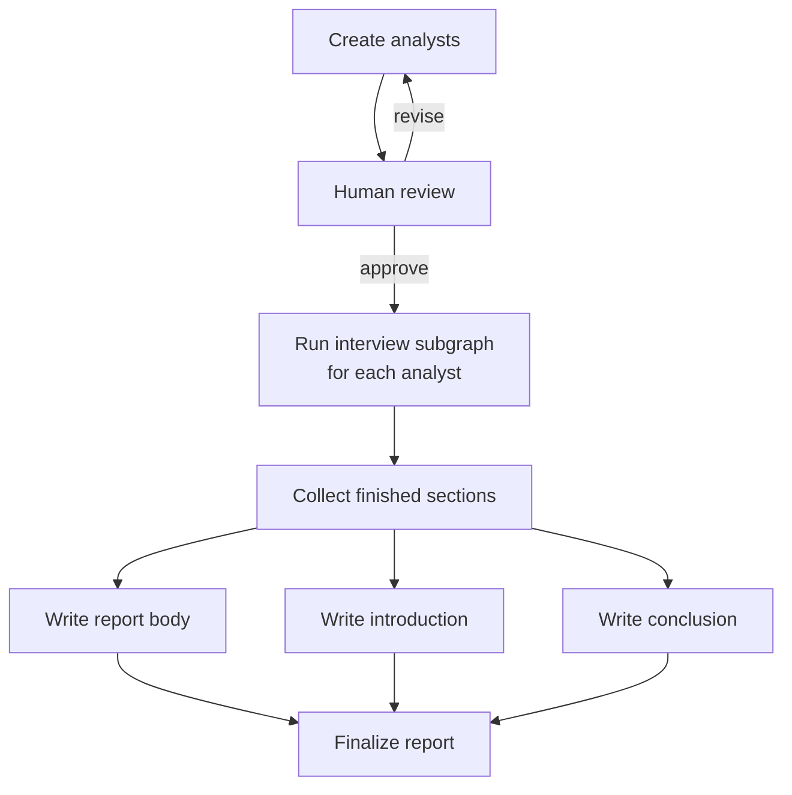
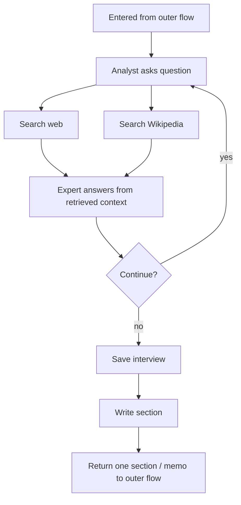

# Module 4.2 Summary: Research Assistant

This note is just for the `research-assistant` example from Module 4.

It was a lot to digest because it is not teaching only one LangGraph trick.
It combines several ideas from earlier modules into one larger system:

- structured output
- human-in-the-loop approval
- parallel interviews
- retrieval during each interview
- map-reduce style report writing
- subgraph composition

The runnable Studio example for this note is:

- `module-4/studio/research_assistant.py`

## Visual map

### Outer flow



The important link is the `Run interview subgraph for each analyst` box.
That single outer-flow box expands into the inner diagram below.

In other words:

- outer diagram: one box says "run the interview workflow"
- inner diagram: this is the workflow that runs inside that box
- after the inner workflow ends, it returns one written section back to the outer graph

### Inner interview flow



## 1. The simplest way to think about it

At a high level, the graph is trying to write a research report on a topic.

It does that in four phases:

1. create a small team of analyst personas
2. let each analyst interview an expert
3. turn each interview into one memo / section
4. combine all sections into one final report

That is the core idea.

If I ignore the implementation details, this graph feels like:

- first plan the perspectives
- then investigate in parallel
- then synthesize everything into one document

That mental model made the example much easier for me.

## 2. Why the tutorial calls this "multi-agent"

This was the most confusing part for me, because at first it did not feel like a true multi-agent system.

The notebook says the goal is to build a lightweight multi-agent system around chat models.
That wording is fair, but only if I use a loose definition of "agent."

What makes it multi-agent in this example is:

- the outer graph creates multiple analyst personas
- each analyst is sent into its own `conduct_interview` subgraph run
- each run has its own local `InterviewState`
- those interview runs happen in parallel
- each run produces one memo / section for the final report

So the agent-like units are not:

- analyst
- searcher
- expert

as three separate agent species.

Instead, the agent-like units are:

- analyst interview worker 1
- analyst interview worker 2
- analyst interview worker 3

and so on.

The cleanest mental model is:

- outer graph = supervisor
- each `conduct_interview` run = one analyst-style worker
- final report stage = reducer / synthesis step

That is why the example can still be called multi-agent.

### What not to be confused about

This file does **not** define a fully separate search agent and a fully separate expert agent.

Inside each interview worker:

- `generate_question` is the analyst behavior
- `search_web` and `search_wikipedia` are retrieval nodes / tools
- `generate_answer` is an expert-style answer step
- `write_section` is the memo-writing step

Those are internal stages inside one interview workflow.
They are not autonomous agents with their own orchestration layer.

So if I use a stricter definition of multi-agent, this example is:

- more than one prompt
- more than one role
- more than one parallel worker

but less than a full society of independent agents.

### The most precise way I would describe it

This example is best described as:

- a supervisor graph
- coordinating multiple parallel analyst interview workers
- where each worker internally uses retrieval and an expert-answer role

That is more precise than saying:

- one analyst agent
- one search agent
- one expert agent

because the searcher and expert are really just steps inside each analyst-centered worker.

## 3. Phase one: create the analysts

The first node is `create_analysts`.

It takes:

- the overall topic
- the maximum number of analysts
- optional human editorial feedback

Then it uses structured output to create a list of `Analyst` objects.

Each analyst has a persona with:

- name
- role
- affiliation
- description

This matters because the graph is not sending identical workers into parallel branches.
It is creating different perspectives on purpose.

So instead of:

- one generic researcher asking everything

it becomes:

- one analyst per theme or angle

That makes the later report broader and more interesting.

## 4. Human approval happens before the expensive work

After creating analysts, the graph pauses at `human_feedback`.

The graph is compiled with:

```python
graph = builder.compile(interrupt_before=['human_feedback'])
```

So the intended workflow is:

1. generate the analyst personas
2. stop
3. let a human review them
4. either approve or ask for a new set

That is a good design choice.
The expensive part of the workflow is all the interviewing and retrieval that happens later.
So the graph asks for approval before spending time and tokens on the full research process.

The router `initiate_all_interviews` checks the human feedback:

- if feedback is not `"approve"`, it goes back to `create_analysts`
- otherwise, it launches the interviews

That makes the analyst-generation step iterative and controllable.

## 5. Each analyst runs through an interview subgraph

This is the part that makes the example feel big.

There is not one flat graph that does everything.
There is a child graph called `interview_builder`, and the outer graph sends each analyst into that subgraph.

So the outer graph is basically saying:

- for each approved analyst
- run one interview workflow
- collect the written section they produce

That means this example is using subgraph composition and parallelization at the same time.

This is also the strongest code-level reason the example counts as multi-agent:

- one subgraph definition
- many independent runs of that subgraph
- one run per analyst persona
- all merged later by the outer graph

## 6. What happens inside one interview

Inside the interview subgraph, the flow is roughly:

1. the analyst asks a question
2. the graph turns that question into a search query
3. it searches the web and Wikipedia in parallel
4. an expert answers using only the retrieved context
5. the graph decides whether the interview should continue
6. when done, it saves the transcript
7. it writes a section from the interview and sources

That is the inner loop.

The actual nodes are:

- `ask_question`
- `search_web`
- `search_wikipedia`
- `answer_question`
- `save_interview`
- `write_section`

What helped me understand this is realizing that the graph is simulating two roles:

- the analyst, who asks questions
- the expert, who answers using retrieved documents

So this is not just retrieval plus summarization.
It is a staged conversation where retrieval feeds the expert answers.

## 7. The interview loop is controlled by a router

The router is `route_messages`.

After each expert answer, it checks whether the interview should continue.

It stops when either:

- the maximum number of expert responses has been reached
- the analyst says, `"Thank you so much for your help!"`

Otherwise it loops back to `ask_question`.

This is important because the graph is not hard-coded to exactly one question and one answer.
It supports a short multi-turn interview.

So the pattern is:

- ask
- retrieve
- answer
- decide whether to continue

That makes the workflow feel agentic, but still bounded.

## 8. Retrieval happens in parallel inside each interview

This part connects the example back to the rest of Module 4.

Inside one interview, after the analyst asks a question, the graph fans out to:

- `search_web`
- `search_wikipedia`

Both write into the shared `context` field, which uses an `add` reducer.

So each interview branch is itself doing fan-out / fan-in.

That means the full graph has parallelism at two levels:

- multiple analysts interviewing in parallel
- multiple retrieval sources inside each interview

That nesting is one reason the example feels more advanced than the earlier Module 4 demos.

## 9. Each interview becomes one section

When an interview ends, the graph saves the transcript and then runs `write_section`.

That node turns the gathered material into a short report section with:

- a title
- a summary
- sources

So each analyst does not directly write the final report.
Each analyst writes one memo.

That was the most useful simplification for me:

- interview output = one memo
- all memos together = input to the final report

Once I looked at it that way, the rest of the graph made much more sense.

## 10. The outer graph is basically a map-reduce report writer

After the interviews are done, the outer graph moves into synthesis.

It launches parallel interview subgraphs using `Send(...)`.

That is the map step:

- one analyst
- one interview workflow
- one section output

Those sections are accumulated in the outer state.

Then the graph writes:

- the main report body with `write_report`
- the introduction with `write_introduction`
- the conclusion with `write_conclusion`

Those run after the interview sections exist, and then `finalize_report` stitches everything together.

So the overall structure is very close to map-reduce:

- map: run one interview per analyst
- collect: accumulate all sections
- reduce: merge sections into one polished report

## 11. Why this example matters

To me, this example is important because it shows what LangGraph looks like when multiple smaller patterns are combined into one application.

It is not introducing a single new primitive.
It is demonstrating composition.

The graph combines:

- structured persona generation
- interruption for human approval
- subgraphs
- routing loops
- parallel retrieval
- `Send`-based fan-out
- reducer-based accumulation
- final synthesis

So this example feels like a mini research pipeline, not just a notebook demo.

## 12. My simplified takeaway

If I had to explain this whole graph in one short paragraph:

The research assistant first creates a few analyst personas, asks a human to approve them, then sends each analyst through a small interview workflow that uses retrieval to answer questions and produce one memo. After all the memos are done, the graph merges them into a final report with an introduction, body, conclusion, and sources.

That is the simple version.

## 13. What I personally want to remember

- The graph is easier to understand if I separate outer flow from inner interview flow.
- The outer graph manages analysts and final report assembly.
- The inner subgraph manages one analyst-expert conversation.
- Human approval is inserted before the expensive parallel work begins.
- `Send` is what turns a list of analysts into parallel interview runs.
- Reducers are what let many branches contribute sections and context safely.
- This example is really a composition demo disguised as a research assistant.
- The multi-agent part is the parallel analyst interview workers, not every role prompt inside the worker.
